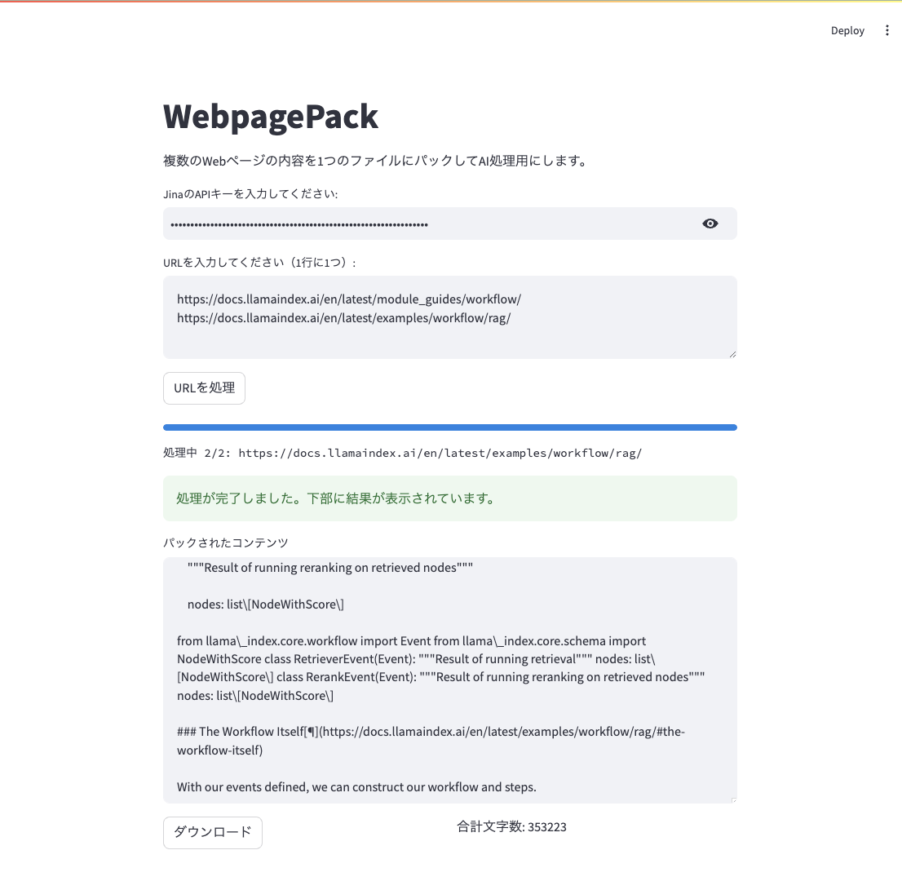

## WebpagePack-Jina

## 謝辞

以下にインスパイアされて作りました。著者の@yamadashyさんに深く感謝します。

[ClaudeやChatGPTにリポジトリを丸ごと読み込ませるコマンドを作りました！](https://qiita.com/yamadashy/items/d150576759b84ea36274)

## 何をするもの？

指定したURLのコンテンツを1ファイルにまとめてくれるツールです。ClaudeやChatGPTに丸ごと読み込ませることができます。



## 必要なもの

- Docker
- Jina API Key
  - Jina Reader APIを使用するため、APIキーが必要です

## 使い方

```
git clone https:
```

## 免責

- 本ツールを使用して、スクレイピング先に損害を与えた場合でも、利用者の責任とし、スクリプト作成者は一切の責任を追わないものとする。
  - **スクレイピングは自己責任でお願いします！**
- Claude/ChatGPT共にアップロードできるコンテンツ量の上限がある模様
  - 明確な値は公開されていないが、自分が試した限りはClaudeのほうがきつかった
  - が、理解度はClaudeのほうが良かった印象（Claude 3.5 Sonnet, gpt-4oで確認、個人の所感）
- URL先のコンテンツの構成・Jina Readerのパースの制約により、無駄なコンテンツ（サイドメニューとか）が含まれてしまう
  - アップロード上限にぶつかるので、余計なコンテンツを削除したり、URLを減らしたりほうが良い場合がある
